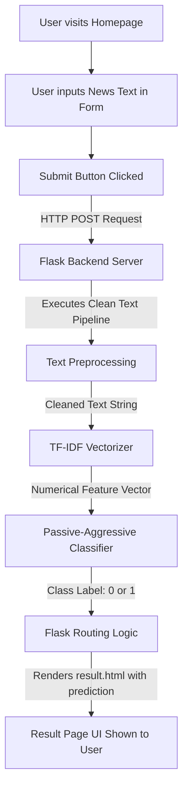

# Fake News Predictor — End-to-End Technical Documentation

Welcome to the comprehensive, end-to-end documentation for the **Fake News Predictor** web application. This document is written in simple English but retains all necessary technical terms to serve as both an educational guide and a developer reference.

---

## Table of Contents
1. [System Architecture Overview](#1-system-architecture-overview)
2. [Frontend Architecture (User Interface)](#2-frontend-architecture-user-interface)
3. [Backend Architecture (Flask Web Server)](#3-backend-architecture-flask-web-server)
4. [Machine Learning Pipeline (Algorithm & Training)](#4-machine-learning-pipeline-algorithm--training)
5. [API Reference (Endpoint Documentation)](#5-api-reference-endpoint-documentation)
6. [Local Setup & Deployment Guide](#6-local-setup--deployment-guide)

---

## 1. System Architecture Overview

The **Fake News Predictor** is a full-stack, machine-learning-powered web application. It allows users to paste any news article text or headline into a browser interface and instantly receive a verdict on whether the article exhibits patterns of **Real News** or **Fake News**.

Below is the conceptual flow of how data moves through the application:



### Key Components:
*   **Frontend**: Built with semantic **HTML5**, modern **Vanilla CSS** (using CSS custom properties, smooth transitions, and a premium dark theme), and lightweight **JavaScript** for client-side interactions.
*   **Backend**: Built with **Flask** (a micro-framework for Python). It handles HTTP requests, routes, serves pages, and interacts with the machine learning models.
*   **Machine Learning (ML)**: Built using **Scikit-Learn** and **NLTK** (Natural Language Toolkit). It leverages a **TF-IDF Vectorizer** for feature extraction and a **Passive-Aggressive Classifier** for ultra-fast, high-accuracy text classification.

---

## 2. Frontend Architecture (User Interface)

The frontend is clean, modern, fully responsive, and styled using a premium, dark-mode design system. It consists of three primary assets:

### A. Home Page (`templates/index.html`)
This is the initial screen presented to the user. It is lightweight and optimized for quick loading and engagement.
*   **Title and Subtitle**: Clean, authoritative instructions inviting the user to analyze news text.
*   **Input Form**: Uses a `<form>` element configured to send an HTTP `POST` request to the `/predict` route.
*   **Textarea Field**: A spacious, styled `<textarea>` with the name `news` where the user pastes the article. It has a `required` attribute to prevent empty submissions.
*   **Client-Side Character Counter**: A small, reactive JavaScript snippet listens for the `input` event on the textarea and dynamically updates the character count on-screen to guide the user.

### B. Result Page (`templates/result.html`)
This page displays the analysis verdict generated by the machine learning model.
*   **Jinja2 Templating**: Flask uses the Jinja2 template engine to conditionally render elements depending on the model's verdict:
    *   **If Real News**: Displays a green card (`.result-card.real-news`) containing a custom **Verified Shield SVG icon**, a "Verified Reporting" headline, and a reassuring verdict description.
    *   **If Fake News**: Displays a red card (`.result-card.fake-news`) containing a custom **Exclamation Warning SVG icon**, a "Proceed with Caution" headline, and a warning description.
*   **Excerpt Display**: The exact text the user submitted is preserved and rendered inside a scroll-optimized box (`.news-box`) so they can review what was analyzed.
*   **Back Navigation**: A styled secondary button redirects the user back to the homepage (`/`) to run another check.

### C. Design System & Styling (`static/style.css`)
Rather than relying on bulky utility libraries, the application uses highly structured, vanilla CSS with modern principles:
*   **Typography**: Imports and uses the **Outfit** font from Google Fonts (a sleek, geometric sans-serif).
*   **Color System (CSS Variables)**:
    ```css
    :root {
        --bg-color: #09090b;       /* Zinc Deep Black */
        --card-bg: #18181b;        /* Zinc Dark Grey Card Background */
        --text-primary: #f4f4f5;   /* Crisp Off-White */
        --text-secondary: #a1a1aa; /* Muted Grey */
        --primary-color: #3b82f6;  /* Electric Blue Accent */
        --real-text: #34d399;      /* Emerald Green for Verified News */
        --fake-text: #fb7185;      /* Rose Red for Fabricated News */
        --border-radius: 12px;
    }
    ```
*   **Interactive Enhancements**: Buttons, text inputs, and cards feature smooth `transition` animations on hover and active states (using subtle scaling `transform: translateY(1px)`).
*   **Responsiveness**: Uses CSS Flexbox, custom box-sizing, and media queries (`@media (max-width: 600px)`) to ensure the app looks stunning on mobile devices, tablets, and desktop monitors.

---

## 3. Backend Architecture (Flask Web Server)

The backend (`app.py`) serves as the orchestrator. It manages the web server lifecycle, loads serialized models from memory, and processes requests.

### A. Initialization & Model Loading
When the application starts, it performs three primary setup tasks:
1.  **Stopwords Download**: Automatically checks and downloads the NLTK `stopwords` corpus (words like *the*, *and*, *in* that are excluded from text analysis).
2.  **Model Loading**: Deserializes the trained machine learning model from disk using Python's `pickle` library:
    ```python
    model = pickle.load(open('models/fake_news_model.pkl', 'rb'))
    ```
3.  **Vectorizer Loading**: Deserializes the pre-fitted text vectorizer:
    ```python
    vectorizer = pickle.load(open('models/tfidf_vectorizer.pkl', 'rb'))
    ```

### B. Request Handling & Routing
The server defines two routing endpoints:

#### 1. Home Route (`/`)
*   **Method**: `GET`
*   **Behavior**: Simply renders and returns the static home screen (`index.html`).

#### 2. Prediction Route (`/predict`)
*   **Method**: `POST`
*   **Behavior**:
    1.  Extracts the raw news text from the submitted form data (`request.form['news']`).
    2.  Passes the raw text to the `clean_text` function to sanitize it.
    3.  Passes the clean text to the TF-IDF Vectorizer (`vectorizer.transform`) to convert it into a numerical feature matrix.
    4.  Feeds the feature matrix into the machine learning model (`model.predict`) to predict the class label:
        *   `0` indicates **FAKE NEWS**
        *   `1` indicates **REAL NEWS**
    5.  Renders the `result.html` template, dynamically passing the prediction string (`"REAL NEWS"` or `"FAKE NEWS"`) and the original raw text.

---

## 4. Machine Learning Pipeline (Algorithm & Training)

The core intelligence of the application lives in its machine learning pipeline, which was fully developed and evaluated in `models/Fake News Predictor.ipynb`.

### A. The Dataset
The model was trained on a robust dataset divided into two sources (stored in `dataset/`):
*   **`True.csv`**: Contains verified, highly credible news reports (e.g., from Reuters).
*   **`Fake.csv`**: Contains fabricated, unverified, or highly biased articles collected from various questionable internet sources.

Each dataset contains fields such as `title`, `text`, `subject`, and `date`.

### B. Data Preparation & Merging
1.  **Label Assignment**: Credibility labels were assigned where `0 = Fake News` and `1 = Real News`.
2.  **Concatenation**: The true and fake datasets were merged together.
3.  **Shuffling**: The combined dataset was shuffled randomly (`df.sample(frac=1)`) to ensure the training partition has an even, unbiased distribution of both classes.
4.  **Feature Integration**: The title and body text were joined together into a single feature string (`df['content'] = df['title'] + " " + df['text']`) to maximize the contextual clues available to the model.

### C. Text Preprocessing (`clean_text` Pipeline)
Raw text is highly noisy and contains elements that are irrelevant to structural pattern analysis. The application applies a specialized cleaning function to standardize the text:

1.  **Case Folding (Lowercasing)**: Converts all text to lowercase. This ensures "Truth", "truth", and "TRUTH" map to the identical mathematical representation.
2.  **URL Removal**: Uses a Regular Expression (`re.sub(r'https?://\S+|www\.\S+', '', text)`) to strip website links, which do not contribute to vocabulary analysis.
3.  **HTML Tag Stripping**: Strips structural HTML elements (`<.*?>`) to keep only raw readable text.
4.  **Punctuation Removal**: Uses string punctuation constants to strip characters like `!`, `?`, `.`, `,` which can interfere with word tokenization.
5.  **Line Break Cleanup**: Removes carriage returns and newline characters (`\n`).
6.  **Alphanumeric / Digits Removal**: Removes numbers or words containing digits (`\w*\d\w*`) because structural patterns of credibility are found in word usage rather than specific numbers (e.g., dates or statistics).
7.  **Tokenization**: Splits the cleaned string into individual words.
8.  **Stopword Filtering**: Loops through the words and discards common English stopwords (e.g., *a*, *an*, *the*, *to*, *of*), as they have high frequency but zero diagnostic value.
9.  **Porter Stemming**: Applies Porter Stemming (`ps.stem(word)`). Stemming reduces a word to its base root form. For example:
    *   *arguing*, *argued*, *argues* $\rightarrow$ **`argu`**
    *   *beautiful*, *beauty* $\rightarrow$ **`beauti`**
    This groups words with the same core semantic meaning together, drastically reducing vocabulary dimension and improving generalizability.

### D. Feature Engineering (TF-IDF Vectorization)
Computers cannot read strings; they require numbers. The clean text is converted into numbers using **TF-IDF (Term Frequency-Inverse Document Frequency)**:
*   **Term Frequency (TF)**: Measures how often a term appears in a document. A high frequency implies the word is highly important to this specific article.
*   **Inverse Document Frequency (IDF)**: Measures how common a word is across *all* articles in the dataset. If a word appears in almost every document (like "report" or "said"), its distinguishing value is low, and its weight is penalized.
*   **Configuration**: The vectorizer is configured with `max_df=0.7`. This means terms that appear in more than 70% of all articles are ignored entirely, removing highly generic words and keeping vocabulary focused.
*   **Result**: Each news article is represented as a sparse numerical vector, where each element corresponds to the TF-IDF weight of a specific stemmed word.

### E. Model Selection: Passive-Aggressive Classifier
The core classifier is a **Passive-Aggressive Classifier**. This is a powerful linear model particularly suited for large-scale text classification:

#### How It Works:
*   **Passive Phase**: If the model makes a correct prediction on a training example (and meets a safety margin), it makes zero changes to its internal weights. It remains passive.
*   **Aggressive Phase**: If the model makes an incorrect prediction, it aggressively calculates and updates its weights to correct its mistake and ensure that if it saw the exact same example again, it would classify it correctly.
*   **Why PAC?**: Unlike standard classifiers (like Logistic Regression), PAC updates its decision boundary incrementally and is extremely fast. In text classification, where features (words) are incredibly numerous (high-dimensional space) but sparse, PAC is exceptionally effective at finding an optimal separating hyperplane.

### F. Performance and Evaluation Metrics
During training, the dataset was split into an **80% Training Set** and a **20% Test Set** (8,980 articles in the test set) to rigorously validate performance. The model achieved world-class metrics:

*   **Overall Test Accuracy**: **`99.63%`** (An outstanding result indicating extremely clean structural differentiation between real and fake datasets).
*   **Classification Report**:
    *   **Class 0 (Fake News)**: Precision = `1.00`, Recall = `1.00`, F1-Score = `1.00` (Support = 4,663)
    *   **Class 1 (Real News)**: Precision = `1.00`, Recall = `1.00`, F1-Score = `1.00` (Support = 4,317)
*   **Confusion Matrix Breakdown**:
    *   **True Negatives** (Fake correctly flagged as Fake): **`4,647`**
    *   **False Positives** (Fake incorrectly flagged as Real): **`16`**
    *   **False Negatives** (Real incorrectly flagged as Fake): **`17`**
    *   **True Positives** (Real correctly flagged as Real): **`4,300`**

---

## 5. API Reference (Endpoint Documentation)

Although the application operates primarily as a traditional web app, it communicates internally via standard HTTP verbs. These endpoints can be integrated or tested programmatically:

### Endpoint 1: Home Page
Retrieves the styled entry layout.
*   **URL**: `/`
*   **Method**: `GET`
*   **Headers**: `Content-Type: text/html`
*   **Response**: Returns the HTML content of the main dashboard.

---

### Endpoint 2: Prediction Analysis
Submits text content to be preprocessed, vectorized, and classified.
*   **URL**: `/predict`
*   **Method**: `POST`
*   **Content-Type**: `application/x-www-form-urlencoded`
*   **Request Payload**:
    | Parameter | Type | Required | Description |
    | :--- | :--- | :--- | :--- |
    | `news` | `string` | Yes | The complete news headline or body text to analyze. |

*   **Sample raw POST payload**:
    ```http
    news=Breaking%20news%20story%20text%20goes%20here...
    ```

*   **Response**: Returns a fully-rendered HTML document containing either the `.real-news` or `.fake-news` card depending on model classification.

---

## 6. Local Setup & Deployment Guide

Follow these steps to run the application on your local machine or prepare it for a cloud server.

### A. Prerequisites
Ensure you have **Python 3.8+** installed on your operating system.

### B. Installation Steps
1.  **Navigate to the project root directory**:
    ```bash
    cd "d:\Fake News Predictor"
    ```
2.  **Create a virtual environment** (optional but highly recommended):
    ```bash
    python -m venv venv
    ```
3.  **Activate the virtual environment**:
    *   **Windows**: `venv\Scripts\activate`
    *   **Mac/Linux**: `source venv/bin/activate`
4.  **Install dependencies**:
    ```bash
    pip install -r requirements.txt
    ```
    *(This will automatically download and install Flask, NumPy, Pandas, Scikit-Learn, NLTK, and Gunicorn).*

### C. Running Locally
Launch the built-in Flask development server:
```bash
python app.py
```
*   The server will download the necessary NLTK stopwords on its initial boot.
*   Open your browser and navigate to `http://127.0.5.1:5000/` or `http://localhost:5000/`.
*   You will be greeted by the dark-mode dashboard. Paste an article to test the backend prediction engine!

### D. Production Deployment
For production servers (such as Heroku, Render, AWS, or DigitalOcean), using Flask's built-in development server is discouraged because it is not designed to handle high volumes of concurrent requests.
*   **Gunicorn (WSGI Server)**: The project includes a `Procfile` configured to serve the app using Gunicorn:
    ```
    web: gunicorn app:app
    ```
    This launches a robust, multi-threaded Web Server Gateway Interface (WSGI) server that efficiently handles concurrent user requests.
